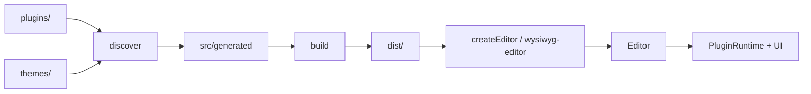

# BaseLab Editor

**Languages:** [English](README.md) · [Português](README.pt.md)

Modular WYSIWYG editor (`@baselab/editor`) with a plugin-based architecture. Use it as an embeddable widget in your app, or develop plugins and themes in this repository.

## Table of contents

- [Features](#features)
- [Quick start (local)](#quick-start-local)
- [Install as a package](#install-as-a-package)
- [Embed / usage](#embed--usage)
- [Configuration](#configuration)
- [Repository map](#repository-map)
- [Architecture](#architecture)
- [Developing plugins](#developing-plugins)
- [Developing themes](#developing-themes)
- [Scripts and Make](#scripts-and-make)
- [Build outputs](#build-outputs)
- [Testing and quality](#testing-and-quality)
- [Contributing](#contributing)

## Features

- Plugin-based formatting, blocks, toolbar, shortcuts, and UI surfaces
- Built-in themes (`padrao`, `escuro`, `corporate`) plus light/dark appearance
- Presets (`default`, `corporate`, `minimalist`) for common setups
- Locales: `pt` (default), `en`, `es`
- Embed via ESM `createEditor`, custom element `<wysiwyg-editor>`, or IIFE `EditorBundle`
- Discovery + build pipeline that bundles plugins, themes, CSS, and types into `dist/`

## Quick start (local)

Requires Node.js (CI uses Node 22).

```bash
npm install          # or: make install
npm run build        # or: make build  (discover + bundle)
npm run dev          # HTTP server on port 3000 (override with PORT=…)
```

| URL | What |
|-----|------|
| `http://localhost:3000/` | Redirects to the demo |
| `http://localhost:3000/demo/` | Dev demo (ESM from `src/`) |
| `http://localhost:3000/page/` | Configuration playground (needs a prior build) |
| `http://localhost:3000/dist/embed.html` | Bundled embed with `<wysiwyg-editor>` |

`make demo` is an alias for `make dev` (runs tests + lint + build, then serves). `make preview` builds and opens the dist embed page.

**Note:** ESM builds must be served over HTTP — do not open them via `file://`. For offline / `file://` use the standalone IIFE bundle and [`embed.file.html`](embed.file.html).

## Install as a package

```bash
npm install @baselab/editor
```

Package exports ([`package.json`](package.json)):

| Export | Resolves to |
|--------|-------------|
| `@baselab/editor` | ESM: `dist/editor.min.js`; default/IIFE: `dist/editor.standalone.min.js`; types: `dist/types/index.d.ts` |
| `@baselab/editor/style.css` | `dist/editor.min.css` |
| `@baselab/editor/sdk` | Plugin SDK (`src/sdk/index.js`, alias `@baselab/plugin-sdk`) |

## Embed / usage

There are three supported patterns. Pick one based on how you load scripts.

### 1. ESM + `createEditor`

```html
<link rel="stylesheet" href="node_modules/@baselab/editor/style.css" />
<textarea id="content">Hello, <strong>world</strong>!</textarea>
<div id="editor"></div>

<script type="module">
  import { createEditor } from '@baselab/editor'

  createEditor({
    textarea: '#content',
    root: '#editor',
    theme: 'padrao',
    locale: 'pt',
  })
</script>
```

From a local clone after `npm run build`, you can also load `dist/editor.min.js` and `dist/editor.min.css` (or the non-minified `dist/editor.js` / `dist/editor.css` during development).

### 2. Custom element

After loading the ESM bundle, `<wysiwyg-editor>` is registered automatically:

```html
<link rel="stylesheet" href="./editor.css" />
<form>
  <textarea id="content" name="content" class="editor-source">Initial text</textarea>
  <wysiwyg-editor for="content" theme="padrao" locale="pt"></wysiwyg-editor>
</form>
<script type="module" src="./editor.js"></script>
```

See [`dist/embed.html`](dist/embed.html) (generated by the build).

### 3. IIFE / `file://`

Use the standalone bundle when you need a global or offline HTML file:

```html
<link rel="stylesheet" href="./dist/editor.css" />
<textarea id="content">Initial text</textarea>
<div id="editor"></div>

<script src="./dist/editor.standalone.js"></script>
<script>
  EditorBundle.createEditor({
    textarea: '#content',
    root: '#editor',
    theme: 'padrao',
    locale: 'pt',
    width: 800,
    height: 500,
    plugins: ['undo', 'redo', 'bold', 'italic', 'underline'],
    toolbar: ['undo redo | bold italic underline'],
  })
</script>
```

Full example: [`embed.file.html`](embed.file.html).

### Main options (`EditorOptions`)

| Option | Description |
|--------|-------------|
| `textarea` | Source `<textarea>` element or CSS selector (required) |
| `root` | Mount element or selector (optional; created when omitted in some flows) |
| `preset` | Named preset: `default`, `corporate`, `minimalist` |
| `plugins` | Plugin ids (`string[]`) or definitions |
| `toolbar` | Toolbar layout (string or string array; see below) |
| `theme` | Theme id (`padrao`, `escuro`, `corporate`, …) |
| `appearance` | `'light'` or `'dark'` |
| `locale` | `'pt'`, `'en'`, or `'es'` |
| `width` / `height` | Editor dimensions (px) |
| `footer` | Show status bar (default `true`) |
| `responsive` | Responsive layout flag |
| `fontFamily` | Default font and picker items |
| `image` | `{ upload, maxSize, minWidth, maxWidth, minHeight, maxHeight }` for the image plugin |
| `assetBaseUrl` | Base URL for plugin assets |
| `persistTheme` / `persistAppearance` | Persist UI choices |

Types live in `dist/types/index.d.ts` after a build.

## Configuration

### Presets

Presets fill in defaults; explicit options override them.

| Preset | Highlights |
|--------|------------|
| `default` | Locale `pt`, theme `padrao` |
| `corporate` | Theme `corporate`, locale `es`, fixed size, small plugin set |
| `minimalist` | Only `bold` / `italic` |

```js
createEditor({
  textarea: '#content',
  preset: 'minimalist',
  theme: 'escuro', // overrides preset theme
})
```

### Themes and appearance

Built-in themes under [`themes/`](themes/):

- `padrao` — default “Padrão”
- `escuro` — dark-oriented palette
- `corporate` — corporate look

Appearance (`light` / `dark`) is separate from the theme id and can be set via `appearance` or the UI.

### Toolbar syntax

Toolbar entries are plugin item ids. Use `|` as a separator. Multiple rows can be an array of strings:

```js
toolbar: [
  'undo redo | bold italic underline',
  'text-color highlight | paragraph | clear-formatting',
]
```

### Built-in plugins

| Id | Role |
|----|------|
| `bold`, `italic`, `underline` | Inline marks |
| `subscript`, `superscript` | Script marks |
| `highlight`, `text-color`, `text-align` | Color / alignment |
| `font-family`, `font-size`, `paragraph` | Typography |
| `bullet-list`, `numbered-list`, `task-list` | Lists |
| `quote`, `hr`, `code-block`, `link`, `image` | Blocks / media |
| `undo`, `redo`, `clear-formatting` | History / cleanup |

## Repository map

| Path | Role |
|------|------|
| `src/` | Editor core, embed, SDK, shared UI |
| `plugins/` | Feature plugins |
| `themes/` | Theme packages |
| `page/`, `demo/` | Config playground and demo |
| `scripts/` | Discovery, build, dist validation |
| `tests/` | Test suite |
| `dist/`, `.build/`, `src/generated/` | Generated outputs — do not edit by hand |

Agent-oriented guidance: [`AGENTS.md`](AGENTS.md). Domain skills live under [`.cursor/skills/`](.cursor/skills/).

## Architecture

Discovery scans `plugins/` and `themes/`, writes registries into `src/generated/`, then the build bundles JS/CSS/types into `dist/`. At runtime, `createEditor` or `<wysiwyg-editor>` resolves config (presets + options), constructs `Editor`, and wires plugin runtime + UI shell.



## Developing plugins

1. Create `plugins/<id>/` with at least `index.js`. Optionally add `styles.css` and `lang/{en,pt,es}.json`.
2. Export a default plugin via the SDK — **import only from `@baselab/plugin-sdk`** (never from `src/core/` or `src/ui/`).
3. Run `npm run discover` or `npm run build` so the registry and CSS pick up the new plugin.

```javascript
// plugins/meu-plugin/index.js
import { definePlugin, mark, command, toolbarItem, shortcut } from '@baselab/plugin-sdk'

export default definePlugin({
  id: 'meu-plugin',
  name: 'Meu Plugin',
  version: '1.0.0',
  capabilities: {
    marks: [mark('highlight', { tag: 'mark', parseTags: ['mark'] })],
    commands: { highlight: command.toggleMark('highlight') },
    toolbar: [
      toolbarItem({
        id: 'highlight',
        label: 'highlight.button',
        activeMark: 'highlight',
      }),
    ],
    shortcuts: shortcut('mod+shift+h', 'highlight'),
  },
})
```

Reference a real plugin: [`plugins/bold/index.js`](plugins/bold/index.js). Deeper checklist: [`.cursor/skills/plugin-development/SKILL.md`](.cursor/skills/plugin-development/SKILL.md).

Capabilities you can declare include marks, blocks, commands, toolbar, shortcuts, i18n, statusbar, sidebar, context/selection menus, inspector, and overlays.

## Developing themes

1. Create `themes/<id>/` with `index.js` and `theme.css` (and `index.d.ts` when applicable).
2. Register with the SDK helper:

```javascript
// themes/meu-tema/index.js
import { theme } from '@baselab/plugin-sdk'

export default theme('meu-tema', 'Meu Tema')
```

3. Scope CSS to the theme selector; support light/dark appearance when relevant.
4. Run `npm run build` so discovery regenerates `src/generated/themes.registry.js` and theme CSS.

Examples: [`themes/padrao/`](themes/padrao/), [`themes/escuro/`](themes/escuro/). Skill: [`.cursor/skills/theme-development/SKILL.md`](.cursor/skills/theme-development/SKILL.md).

## Scripts and Make

| npm | Make | Description |
|-----|------|-------------|
| `npm install` | `make install` | Install dependencies |
| `npm run discover` | `make discover` | Generate `src/generated/` |
| `npm run build` | `make build` | Discover + bundle `dist/` |
| `npm run dev` | — | Dev HTTP server (port `3000` / `PORT`) |
| — | `make dev` / `make demo` | test → lint → build → server |
| — | `make preview` | build + serve dist embed |
| `npm run lint` | `make lint` | ESLint |
| `npm run typecheck` | — | TypeScript `--noEmit` |
| `npm test` | `make test` | Node test runner (`tests/**/*.test.js`) |
| `npm run validate:dist` | — | Assert required dist artifacts |
| `npm run prepush` / `npm run fix` | `make fix` | lint + typecheck + test + build + validate |
| — | `make clean` | Remove `dist/` and `src/generated/` |
| — | `make distclean` | clean + remove `node_modules/` |

`prepare` / `postinstall` point Git hooks at [`.githooks/`](.githooks/).

## Build outputs

After `npm run build`, expect under `dist/`:

| Artifact | Purpose |
|----------|---------|
| `editor.js` / `editor.min.js` (+ map) | ESM bundle |
| `editor.standalone.js` / `editor.standalone.min.js` (+ map) | IIFE (`EditorBundle`) |
| `editor.css` / `editor.min.css` (+ map) | Styles |
| `types/index.d.ts` | Public TypeScript types |
| `embed.html` / `embed.file.html` | Sample embed pages |

Generated registries and CSS also land in `src/generated/` — treat them as build products.

## Testing and quality

```bash
npm test
# or a single file:
node --test tests/embed-integration.test.js
```

CI ([`.github/workflows/ci.yml`](.github/workflows/ci.yml)) runs lint → typecheck → test → build → `validate:dist` on Node 22.

Local hooks:

- **pre-commit** — lint, typecheck, test
- **pre-push** — full pipeline (same as `prepush`)
- **commit-msg** — strips agent co-author trailers

Recommended validation order for contributors: see [`.cursor/skills/verify-changes/SKILL.md`](.cursor/skills/verify-changes/SKILL.md).

## Contributing

1. Keep changes narrow and match existing patterns in the nearest sibling file.
2. Prefer the matching domain skill under [`.cursor/skills/`](.cursor/skills/) (plugins, themes, core, page, i18n, build, verify).
3. Add or update tests for user-facing behavior.
4. Before pushing, run `npm run prepush` or `make fix`.

Repository map and agent rules: [`AGENTS.md`](AGENTS.md).
