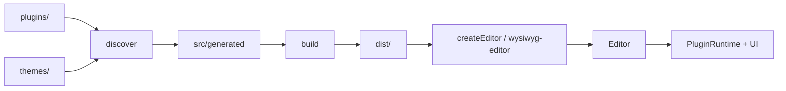

# BaseLab Editor

**Idiomas:** [English](README.md) · [Português](README.pt.md)

Editor WYSIWYG modular (`@baselab/editor`) com arquitetura baseada em plugins. Use-o como widget embutível no seu app, ou desenvolva plugins e temas neste repositório.

## Sumário

- [Funcionalidades](#funcionalidades)
- [Início rápido (local)](#início-rápido-local)
- [Instalar como pacote](#instalar-como-pacote)
- [Embed / uso](#embed--uso)
- [Configuração](#configuração)
- [Mapa do repositório](#mapa-do-repositório)
- [Arquitetura](#arquitetura)
- [Desenvolver plugins](#desenvolver-plugins)
- [Desenvolver temas](#desenvolver-temas)
- [Scripts e Make](#scripts-e-make)
- [Artefatos do build](#artefatos-do-build)
- [Testes e qualidade](#testes-e-qualidade)
- [Contribuindo](#contribuindo)

## Funcionalidades

- Formatação, blocos, toolbar, atalhos e superfícies de UI baseados em plugins
- Temas embutidos (`padrao`, `escuro`, `corporate`) e aparência claro/escuro
- Presets (`default`, `corporate`, `minimalist`) para configurações comuns
- Locales: `pt` (padrão), `en`, `es`
- Embed via ESM `createEditor`, custom element `<wysiwyg-editor>` ou IIFE `EditorBundle`
- Pipeline de discovery + build que empacota plugins, temas, CSS e types em `dist/`

## Início rápido (local)

Requer Node.js (o CI usa Node 22).

```bash
npm install          # ou: make install
npm run build        # ou: make build  (discover + bundle)
npm run dev          # servidor HTTP na porta 3000 (sobrescreva com PORT=…)
```

| URL | O quê |
|-----|------|
| `http://localhost:3000/` | Redireciona para o demo |
| `http://localhost:3000/demo/` | Demo de desenvolvimento (ESM a partir de `src/`) |
| `http://localhost:3000/pages/` | Playground de configuração (precisa de um build prévio) |
| `http://localhost:3000/dist/embed.html` | Embed empacotado com `<wysiwyg-editor>` |

`make demo` é alias de `make dev` (roda testes + lint + build e sobe o servidor). `make preview` faz o build e abre a página de embed do dist.

**Nota:** builds ESM precisam ser servidos via HTTP — não abra via `file://`. Para uso offline / `file://`, use o bundle standalone IIFE e [`embed.file.html`](embed.file.html).

## Instalar como pacote

```bash
npm install @baselab/editor
```

Exports do pacote ([`package.json`](package.json)):

| Export | Resolve para |
|--------|-------------|
| `@baselab/editor` | ESM: `dist/editor.min.js`; default/IIFE: `dist/editor.standalone.min.js`; types: `dist/types/index.d.ts` |
| `@baselab/editor/style.css` | `dist/editor.min.css` |
| `@baselab/editor/sdk` | Plugin SDK (`src/sdk/index.js`, alias `@baselab/plugin-sdk`) |

## Embed / uso

Há três padrões suportados. Escolha conforme a forma de carregar os scripts.

### 1. ESM + `createEditor`

```html
<link rel="stylesheet" href="node_modules/@baselab/editor/style.css" />
<textarea id="content">Olá, <strong>mundo</strong>!</textarea>
<div id="editor"></div>

<script type="module">
  import { createEditor } from '@baselab/editor'

  createEditor({
    textarea: '#content',
    root: '#editor',
    theme: 'padrao',
    locale: 'pt',
  })
</script>
```

Em um clone local após `npm run build`, você também pode carregar `dist/editor.min.js` e `dist/editor.min.css` (ou as versões sem minify `dist/editor.js` / `dist/editor.css` durante o desenvolvimento).

### 2. Custom element

Após carregar o bundle ESM, `<wysiwyg-editor>` é registrado automaticamente:

```html
<link rel="stylesheet" href="./editor.css" />
<form>
  <textarea id="content" name="content" class="editor-source">Texto inicial</textarea>
  <wysiwyg-editor for="content" theme="padrao" locale="pt"></wysiwyg-editor>
</form>
<script type="module" src="./editor.js"></script>
```

Veja [`dist/embed.html`](dist/embed.html) (gerado pelo build).

### 3. IIFE / `file://`

Use o bundle standalone quando precisar de um global ou de um HTML offline:

```html
<link rel="stylesheet" href="./dist/editor.css" />
<textarea id="content">Texto inicial</textarea>
<div id="editor"></div>

<script src="./dist/editor.standalone.js"></script>
<script>
  EditorBundle.createEditor({
    textarea: '#content',
    root: '#editor',
    theme: 'padrao',
    locale: 'pt',
    width: 800,
    height: 500,
    plugins: ['undo', 'redo', 'bold', 'italic', 'underline'],
    toolbar: ['undo redo | bold italic underline'],
  })
</script>
```

Exemplo completo: [`embed.file.html`](embed.file.html).

### Opções principais (`EditorOptions`)

| Opção | Descrição |
|--------|-------------|
| `textarea` | Elemento `<textarea>` de origem ou seletor CSS (obrigatório) |
| `root` | Elemento de montagem ou seletor (opcional; em alguns fluxos é criado automaticamente) |
| `preset` | Preset nomeado: `default`, `corporate`, `minimalist` |
| `plugins` | Ids de plugins (`string[]`) ou definições |
| `toolbar` | Layout da toolbar (string ou array de strings; ver abaixo) |
| `theme` | Id do tema (`padrao`, `escuro`, `corporate`, …) |
| `appearance` | `'light'` ou `'dark'` |
| `locale` | `'pt'`, `'en'` ou `'es'` |
| `width` / `height` | Dimensões do editor (px) |
| `footer` | Exibe a barra de status (padrão `true`) |
| `responsive` | Flag de layout responsivo |
| `fontFamily` | Fonte padrão e itens do seletor |
| `image` | `{ upload, maxSize, minWidth, maxWidth, minHeight, maxHeight }` para o plugin de imagem |
| `assetBaseUrl` | URL base para assets de plugins |
| `persistTheme` / `persistAppearance` | Persiste escolhas de UI |

Os types ficam em `dist/types/index.d.ts` após o build.

## Configuração

### Presets

Presets preenchem defaults; opções explícitas têm prioridade.

| Preset | Destaques |
|--------|------------|
| `default` | Locale `pt`, tema `padrao` |
| `corporate` | Tema `corporate`, locale `es`, tamanho fixo, conjunto pequeno de plugins |
| `minimalist` | Apenas `bold` / `italic` |

```js
createEditor({
  textarea: '#content',
  preset: 'minimalist',
  theme: 'escuro', // sobrescreve o tema do preset
})
```

### Temas e aparência

Temas embutidos em [`themes/`](themes/):

- `padrao` — “Padrão” (default)
- `escuro` — paleta voltada ao escuro
- `corporate` — visual corporativo

A aparência (`light` / `dark`) é independente do id do tema e pode ser definida via `appearance` ou pela UI.

### Sintaxe da toolbar

As entradas da toolbar são ids de itens de plugins. Use `|` como separador. Várias linhas podem ser um array de strings:

```js
toolbar: [
  'undo redo | bold italic underline',
  'text-color highlight | paragraph | clear-formatting',
]
```

### Plugins embutidos

| Id | Função |
|----|------|
| `bold`, `italic`, `underline` | Marks inline |
| `subscript`, `superscript` | Super/subscrito |
| `highlight`, `text-color`, `text-align` | Cor / alinhamento |
| `font-family`, `font-size`, `paragraph` | Tipografia |
| `bullet-list`, `numbered-list`, `task-list` | Listas |
| `quote`, `hr`, `code-block`, `link`, `image` | Blocos / mídia |
| `undo`, `redo`, `clear-formatting` | Histórico / limpeza |

## Mapa do repositório

| Caminho | Papel |
|------|------|
| `src/` | Core do editor, embed, SDK, UI compartilhada |
| `plugins/` | Plugins de funcionalidade |
| `themes/` | Pacotes de tema |
| `pages/`, `demo/` | Playground de config e demo |
| `scripts/` | Discovery, build, validação do dist |
| `tests/` | Suite de testes |
| `dist/`, `.build/`, `src/generated/` | Saídas geradas — não edite à mão |

Orientação para agentes: [`AGENTS.md`](AGENTS.md). Skills de domínio em [`.cursor/skills/`](.cursor/skills/).

## Arquitetura

O discovery varre `plugins/` e `themes/`, grava registries em `src/generated/`, e o build empacota JS/CSS/types em `dist/`. Em runtime, `createEditor` ou `<wysiwyg-editor>` resolve a config (presets + opções), instancia `Editor` e conecta o runtime de plugins + shell de UI.



## Desenvolver plugins

1. Crie `plugins/<id>/` com pelo menos `index.js`. Opcionalmente adicione `styles.css` e `lang/{en,pt,es}.json`.
2. Exporte um plugin default via SDK — **importe apenas de `@baselab/plugin-sdk`** (nunca de `src/core/` ou `src/ui/`).
3. Rode `npm run discover` ou `npm run build` para o registry e o CSS incorporarem o novo plugin.

```javascript
// plugins/meu-plugin/index.js
import { definePlugin, mark, command, toolbarItem, shortcut } from '@baselab/plugin-sdk'

export default definePlugin({
  id: 'meu-plugin',
  name: 'Meu Plugin',
  version: '1.0.0',
  capabilities: {
    marks: [mark('highlight', { tag: 'mark', parseTags: ['mark'] })],
    commands: { highlight: command.toggleMark('highlight') },
    toolbar: [
      toolbarItem({
        id: 'highlight',
        label: 'highlight.button',
        activeMark: 'highlight',
      }),
    ],
    shortcuts: shortcut('mod+shift+h', 'highlight'),
  },
})
```

Plugin real de referência: [`plugins/bold/index.js`](plugins/bold/index.js). Checklist mais detalhado: [`.cursor/skills/plugin-development/SKILL.md`](.cursor/skills/plugin-development/SKILL.md).

Capabilities que você pode declarar incluem marks, blocks, commands, toolbar, shortcuts, i18n, statusbar, sidebar, menus de contexto/seleção, inspector e overlays.

## Desenvolver temas

1. Crie `themes/<id>/` com `index.js` e `theme.css` (e `index.d.ts` quando aplicável).
2. Registre com o helper do SDK:

```javascript
// themes/meu-tema/index.js
import { theme } from '@baselab/plugin-sdk'

export default theme('meu-tema', 'Meu Tema')
```

3. Escopo o CSS no seletor do tema; suporte light/dark quando fizer sentido.
4. Rode `npm run build` para o discovery regenerar `src/generated/themes.registry.js` e o CSS de temas.

Exemplos: [`themes/padrao/`](themes/padrao/), [`themes/escuro/`](themes/escuro/). Skill: [`.cursor/skills/theme-development/SKILL.md`](.cursor/skills/theme-development/SKILL.md).

## Scripts e Make

| npm | Make | Descrição |
|-----|------|-------------|
| `npm install` | `make install` | Instala dependências |
| `npm run discover` | `make discover` | Gera `src/generated/` |
| `npm run build` | `make build` | Discover + bundle em `dist/` |
| `npm run dev` | — | Servidor HTTP de desenvolvimento (porta `3000` / `PORT`) |
| — | `make dev` / `make demo` | test → lint → build → servidor |
| — | `make preview` | build + serve o embed do dist |
| `npm run lint` | `make lint` | ESLint |
| `npm run typecheck` | — | TypeScript `--noEmit` |
| `npm test` | `make test` | Node test runner (`tests/**/*.test.js`) |
| `npm run validate:dist` | — | Valida artefatos obrigatórios do dist |
| `npm run prepush` / `npm run fix` | `make fix` | lint + typecheck + test + build + validate |
| — | `make clean` | Remove `dist/` e `src/generated/` |
| — | `make distclean` | clean + remove `node_modules/` |

`prepare` / `postinstall` apontam os hooks do Git para [`.githooks/`](.githooks/).

## Artefatos do build

Após `npm run build`, espere em `dist/`:

| Artefato | Finalidade |
|----------|---------|
| `editor.js` / `editor.min.js` (+ map) | Bundle ESM |
| `editor.standalone.js` / `editor.standalone.min.js` (+ map) | IIFE (`EditorBundle`) |
| `editor.css` / `editor.min.css` (+ map) | Estilos |
| `types/index.d.ts` | Types TypeScript públicos |
| `embed.html` / `embed.file.html` | Páginas de exemplo de embed |

Registries e CSS gerados também vão para `src/generated/` — trate-os como produtos do build.

## Testes e qualidade

```bash
npm test
# ou um arquivo só:
node --test tests/embed-integration.test.js
```

O CI ([`.github/workflows/ci.yml`](.github/workflows/ci.yml)) roda lint → typecheck → test → build → `validate:dist` no Node 22.

Hooks locais:

- **pre-commit** — lint, typecheck, test
- **pre-push** — pipeline completo (igual ao `prepush`)
- **commit-msg** — remove trailers de co-author de agentes

Ordem de validação recomendada para contribuidores: [`.cursor/skills/verify-changes/SKILL.md`](.cursor/skills/verify-changes/SKILL.md).

## Contribuindo

1. Mantenha mudanças estreitas e siga os padrões do arquivo irmão mais próximo.
2. Prefira a skill de domínio correspondente em [`.cursor/skills/`](.cursor/skills/) (plugins, themes, core, pages, i18n, build, verify).
3. Adicione ou atualize testes para comportamento visível ao usuário.
4. Antes do push, rode `npm run prepush` ou `make fix`.

Mapa do repositório e regras para agentes: [`AGENTS.md`](AGENTS.md).
